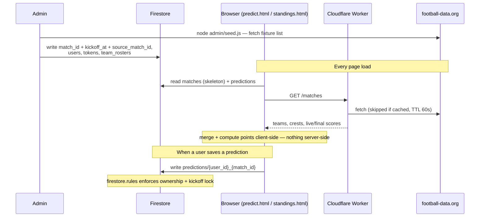

# Polla — World Cup 2026 Prediction Pool

Static site (no build step) + Firebase Firestore, for a private group predicting
match scores from the Round of 16 onward. See `CLAUDE.md` for full project context.

## How it works



Two flows never touch each other:

- **Saving a prediction** is a direct browser → Firestore write, gated
  entirely by `firestore.rules` (ownership + "has this match kicked off
  yet"). The Worker is never involved.
- **Reading match data** (teams, crests, live/final scores) never touches
  Firestore for anything beyond `match_id`/`kickoff_at`/`source_match_id` —
  everything else comes from the Worker on every page load, merged
  client-side by `js/worker-matches.mjs`, and is never written back to
  Firestore.

`admin/seed.js` is the only thing that writes match/user data, and it's the
one piece of this diagram a human runs on purpose — once at the start, and
again whenever the fixture or squads change (see "Admin workflows" below).
Nothing computes or stores points anywhere either: `standings.html` reads
raw predictions + results every time and recomputes with
`js/scoring-logic.mjs` + `js/standings-logic.mjs`.

## Project structure

- **`*.html`, `css/`** — the static site itself, no build step, opened
  straight in a browser
- **`js/`** — client-side logic: Firestore + Worker reads, token auth,
  scoring/standings computation, and each page's own glue (`predict.js`,
  `special.js`, `standings.js`)
- **`firestore.rules`** — the actual security enforcement boundary (see
  `CLAUDE.md` for the design)
- **`scoring_config.json`** — tunable point/multiplier weights, read by
  `js/scoring-logic.mjs`
- **`worker/`** — Cloudflare Worker proxying football-data.org, KV-cached
  (see "Cloudflare Worker match proxy" below)
- **`admin/`** — local-only Admin SDK scripts (seed the fixture/users/
  rosters, rename a user) — never deployed anywhere, run by hand from your
  machine
- **`automation/`** — admin-triggered GitHub Actions script (the
  missing-predictions report)
- **`test/`** — unit tests (`node:test`) for every pure `.mjs` module in
  `js/`/`worker/`, plus the Firestore rules tests (need the local emulator)
- **`.github/workflows/`** — CI (tests + auto-deploying `firestore.rules`)
  and the on-demand missing-predictions report

## How auth works without passwords, SMS, or a server

Each user gets a unique unguessable token in their URL. Firestore security
rules can't read URL params directly, so the client:

1. Signs in anonymously (free, no card required) to get a real `request.auth.uid`.
2. Looks up `tokens/{token}` to find the matching `user_id`.
3. Creates a one-time `auth_links/{auth_uid} → { user_id, token }` binding doc,
   which the security rules verify actually matches the real token before
   allowing it to be created.

From then on, rules use that binding to check "this browser can only write
this user's predictions." Multiple devices for the same person just create
independent binding docs — no coordination needed. See `firestore.rules` and
`CLAUDE.md` for the full design rationale.

## Setup (one-time)

1. **Create the Firebase project**
   - [Firebase Console](https://console.firebase.google.com/) → Add project.
   - Build → Firestore Database → Create database (production mode).
   - Build → Authentication → Sign-in method → enable **Anonymous**.
   - Project Settings → General → Your apps → Add app → Web app. Skip "Also
     set up Firebase Hosting" (this project deploys via GitHub Pages, not
     Firebase Hosting). When asked how to add the SDK, choose **`<script>` tag**
     (not npm) — the frontend has no build step, and `js/firebase-init.js`
     already imports the SDK as ES modules straight from the
     `gstatic.com/firebasejs/...` CDN URLs, matching that option. Copy the
     `firebaseConfig` object shown into `js/firebase-config.js` (replace the
     `REPLACE_ME` values); you can ignore the rest of the install snippet.
   - Project Settings → Service accounts → Generate new private key. Save the
     downloaded file as `admin/serviceAccountKey.json` (this is gitignored —
     never commit it).
   - `.firebaserc` → replace `REPLACE_WITH_FIREBASE_PROJECT_ID` with your real
     Firebase project ID.

2. **Set up the Cloudflare Worker** (see "Cloudflare Worker match proxy"
   below for what it does)
   - [dash.cloudflare.com/sign-up](https://dash.cloudflare.com/sign-up) →
     sign up with an email + password (no card required for the Workers free
     tier — 100,000 requests/day, far more than this pool's clients will
     ever use). Verify the email, log in to the dashboard once — no
     project/site needs to be created there manually, `wrangler deploy`
     (further down this list) creates the Worker itself.
   - `npm install -g wrangler` (or run it via `npx` from `worker/`), then
     `npx wrangler login` — opens a browser tab to authorize the CLI against
     the account you just created.
   - From `worker/`: `npx wrangler kv namespace create MATCH_CACHE`, then
     paste the returned namespace `id` into `wrangler.toml`'s
     `[[kv_namespaces]]` block.
   - `npx wrangler secret put API_KEY` from `worker/` — `API_KEY` here is
     the secret's *name* (must match `env.API_KEY` in
     `worker/src/index.mjs`), not the value. Wrangler then prompts you
     interactively for the value: paste a free API key from
     [football-data.org](https://www.football-data.org/) (sign up, then
     copy the key from your account dashboard — the same token
     `admin/seed.js` uses via `FOOTBALL_DATA_TOKEN`, see the next step).
   - `npm run deploy` from `worker/` (wraps `wrangler deploy`). Wrangler
     prints the deployed Worker's URL — paste it into
     `js/worker-config.js`'s `WORKER_URL`.

3. **Seed the fixture and users**
   - Edit `admin/seed.js`: fill in `USERS` (your group's clients) — matches
     themselves need no hand-typed fixture list, see below.
   - `cd admin && npm install`
   - `FOOTBALL_DATA_TOKEN=<your token> node seed.js` (free key from
     [football-data.org](https://www.football-data.org/)) — **required**:
     `seedMatches()` fetches the competition's full fixture list itself and
     derives `match_id`/`kickoff_at`/`source_match_id` for every match
     (team names/scores come from the Worker at read time, not from this
     script). The same run also seeds `team_rosters/{team}` — every team's
     squad in one API call, backing the champion/top-scorer dropdowns on
     `special.html`.
   - The script prints each client's `predict.html?token=...` link — save
     these, they aren't shown again unless you add a brand-new user later.
   - Safe to re-run any time (e.g. once brackets update, or a squad changes
     materially like a late injury replacement) — existing matches keep
     their `match_id`, existing users keep their token.

4. **Deploy the security rules**
   - Requires the [Firebase CLI](https://firebase.google.com/docs/cli):
     `npm install -g firebase-tools`, then `firebase login`.
   - `firebase deploy --only firestore:rules`
   - This one-time manual run is only needed for the very first deploy.
     After that, `.github/workflows/ci.yml`'s `deploy-rules` job redeploys
     `firestore.rules` automatically on every push to `main` (once tests
     pass) — no more remembering to run this by hand after merging a PR
     that touches the rules. This (and `automation/missing-predictions.js`'s
     workflow) needs a repo Secret: Settings → Secrets and variables →
     Actions → New repository secret → `FIREBASE_SERVICE_ACCOUNT_JSON`,
     value is the **entire contents** of `admin/serviceAccountKey.json`
     (same key used locally by `admin/seed.js`; this grants the workflows
     the same Admin SDK access).
   - The service account behind that secret needs an extra IAM role beyond
     what the other automation workflows require: Firebase's default
     Admin SDK service account (`firebase-adminsdk-...@<project>.iam.gserviceaccount.com`,
     the one whose key you downloaded above) only has Admin SDK access
     (Firestore/Auth reads and writes) by default, not the
     `firebaserules.*` permissions the CLI needs to validate and publish
     rules. Deploying rules from CI fails with a `403` from
     `firebaserules.googleapis.com` until you grant that same service
     account the **Firebase Rules Admin** role (Google Cloud Console → IAM
     & Admin → IAM → find the `firebase-adminsdk-...` account → Edit →
     Add another role — search "rules"; if that specific role isn't
     offered, the broader **Firebase Admin** role also works, just with
     more access than strictly needed). This is a one-time grant tied to
     the service account itself, not the key — regenerating
     `admin/serviceAccountKey.json` later doesn't require repeating it.
     No billing plan or cost is involved; IAM role grants are free.

5. **Enable GitHub Pages**
   - Repo Settings → Pages → Source: "Deploy from a branch" → Branch: `main`,
     folder `/ (root)`.
   - The site will be served at `https://johansmm.github.io/polla-futbolera/`
     (the repo name, `polla-futbolera` — not the local folder name used
     during development).

## Local testing

Serve the repo root with any static file server (e.g. `npx serve .` or the
VS Code "Live Server" extension) and open `predict.html?token=<a seeded token>`.
Firebase config must already point at your real project — there's no
emulator/mocking layer for the MVP.

## Running tests

Security-rules tests run against the local Firestore emulator, which requires
a JRE (the emulator itself is a Java process — Node/npm alone aren't enough).

```
winget install EclipseAdoptium.Temurin.21.JRE   # one-time, if `java -version` fails
npm install                                      # root devDependencies (first time only)
cd automation && npm install && cd ..            # automation/missing-predictions.js's own dependency (first time only)
npm test
```

`node --test test/` auto-discovers every test file in the directory,
currently:

- `test/firestore.rules.test.js` — runs against `firestore.rules` via
  `@firebase/rules-unit-testing` (needs the emulator), covering:
  unauthenticated reads being denied, the token→`auth_links` binding
  requiring the real token, owners vs. strangers writing predictions, the
  auto-lock check (purely `kickoff_at` — no stored `locked` field), other users'
  predictions staying hidden until a match kicks off, and
  `special_predictions` being editable only before its configured deadline.
- `test/worker-matches.test.js` — plain unit tests for `js/worker-matches.mjs`'s
  merge logic: stage-to-phase translation, the finished/live result-field
  mapping, and matching a Firestore match to its Worker entry by
  `source_match_id`.
- `test/lock-logic.test.js` — plain unit tests for `js/lock-logic.mjs`'s
  timing/lookup logic (`isMatchLocked`, `isPastDeadline`, `findTeamForPlayer`),
  shared by `predict.js`, `special.js`, and `standings.js`. Loaded via dynamic
  `import()` since it's a real ES module (`.mjs`) in an otherwise CommonJS
  test suite — the only `js/*.js` file with no CDN import, so the only one
  Node can load directly.
- `test/scoring-logic.test.js` — plain unit tests for `js/scoring-logic.mjs`'s
  pure scoring functions (`scoreMatch`, `calculateChampionPoints`,
  `calculateTopScorerPoints`), including the drawn-match edge case where a
  correctly-predicted draw must not be mistaken for "correct winner +
  correct difference" just because a draw's goal difference is always 0.
  Loaded the same way as `lock-logic.test.js` above, since this is also a
  real `.mjs` module.

GitHub Actions runs the same tests (plus a `node --check` syntax pass over
every `.js`/`.mjs` file in the repo) on every pull request and push to
`main` — see `.github/workflows/ci.yml`. The Actions runner already has
Java preinstalled, so no extra setup is needed there. On push to `main`
specifically, a second job (`deploy-rules`) runs after tests pass and
redeploys `firestore.rules` automatically — see "Deploy the security rules"
above.

## Cloudflare Worker match proxy

`worker/` is a Cloudflare Worker that proxies football-data.org. The client
(`js/worker-matches.mjs`) fetches match data (teams, crests, live/final
scores) from here directly on page load and merges it with Firestore's
`matches` collection, which only ever holds `match_id`/`kickoff_at`/
`source_match_id` — the fields security rules actually need, since rules
can't call external APIs. This replaced a scheduled GitHub Actions job that
used to write fixture/result data into Firestore directly.

The Worker exposes one read-only route, backed by a Workers KV cache shared
across every concurrent client so the group loading the app at once doesn't
multiply real football-data.org calls:

- `GET /matches` → every World Cup match in one response — scheduled
  fixtures, in-progress scores, and finished results alike, exactly as
  football-data.org returns them — cached 60s, which keeps a live match's
  score reasonably fresh without approaching the free tier's 10 calls/min
  limit (60s cache ≈ 1 call/min)

One-time setup (Cloudflare account, KV namespace, secret, deploy) is step 2
of "Setup (one-time)" above.

`npm run dev` from `worker/` runs it locally via `wrangler dev` for testing
against real football-data.org calls. `wrangler dev` doesn't read the secret
you pushed with `wrangler secret put` (that's production-only), so for local
testing create `worker/.dev.vars` (gitignored) with:

```
API_KEY=your-football-data.org-token
```

## Admin workflows (ongoing)

- **Match results aren't entered anywhere** — nothing to do once a match
  ends. football-data.org marks it `FINISHED`, the Worker serves that score
  on the next request, and every client picks it up automatically. Matches
  also lock purely by `kickoff_at` (enforced in `firestore.rules`) — there's
  no admin override to force a match locked early.
- **Regenerate a user's token** (e.g. they lost their link): in the Console,
  delete `tokens/{oldToken}`, create `tokens/{newToken} → { user_id }`, and
  update `users/{user_id}.token` to the new value. If the old link may have
  leaked to someone else, also delete that user's docs under `auth_links`
  (query by `user_id` in the Console) to force every device to re-bind.
- **Add a new user after launch**: add them to `USERS` in `admin/seed.js` and
  re-run `node seed.js` — existing users are skipped, so their tokens don't change.
- **Pick up new or rescheduled matches later** (e.g. the bracket for the next
  phase just got confirmed, or a kickoff time moved): just re-run
  `FOOTBALL_DATA_TOKEN=<your token> node seed.js` — it re-fetches the
  competition's fixture list itself, so nothing needs hand-editing. Existing
  matches keep their `match_id`; only `kickoff_at` gets refreshed if it
  changed.
- **The champion/top-scorer picks deadline** (`config/special_predictions.locked_after`)
  recomputes automatically every time `node seed.js` runs, from whatever the
  earliest Round-of-16-or-later kickoff is in the fixture list it just
  fetched — no manual date entry needed. If football-data.org hasn't
  published any of those phases' kickoff times yet, this step is skipped
  (logged), and `special.html` stays locked by default (fail-closed) until
  it exists.
- **Fix a user's name or `user_id`**: `cd admin && node rename-user.js ...`
  - `node rename-user.js name <user_id> "New Name"` — just updates the
    cosmetic `name` field (shown in `seed.js` logs and the
    missing-predictions report). Doesn't touch tokens, predictions, or
    anything else.
  - `node rename-user.js id <old_id> <new_id> [new_name]` — renames the
    `user_id` itself everywhere it's referenced (`users`, `tokens`,
    `auth_links`, `predictions`, `special_predictions`), keeping the same
    token (so nobody's link breaks) and preserving every predicted score
    and pick. Everything is copied under the new id before anything is
    deleted from the old one, so a failure partway through leaves
    duplicated data, never lost data.
- **Points aren't calculated by an admin step at all** — there's nothing to
  run once a match ends. `standings.html` reads
  `matches`/`predictions`/`special_predictions` directly and computes
  everyone's points on the fly using `js/scoring-logic.mjs` +
  `scoring_config.json`, so there's no `points_earned` field to recompute or
  go stale. The one manual step that *is* still needed: once the tournament
  top scorer is known (not tracked anywhere else in Firestore), set
  `config/tournament_results → { top_scorer: "...", top_3_scorers: ["...", "...", "..."] }`
  via the Console — champion/finalists/semifinalists are derived
  automatically from the `final`/`sf` matches instead.

## Missing predictions report (manual)

`.github/workflows/missing-predictions.yml` runs `automation/missing-predictions.js`
on demand only (`workflow_dispatch` — no schedule) — trigger it from the
Actions tab, including from the GitHub mobile app, so you don't need your
computer on to check who still needs a nudge. Per user, lists which matches
kicking off in the next 24 hours they still have no `predictions` doc for,
plus their champion/top-scorer picks if that deadline also falls in the next
24 hours — one line per user, ready to paste into a nudge message. Each item
shows how much time is left before it locks (`HHhMMm`), e.g.:

```
Users with missing predictions in the next 24h:
* Jane Doe: Canada vs Morocco (r16_01, 05h17m), Champion pick (05h17m), Top scorer pick (05h17m)

(HHhMMm) = time left before that item locks.
```

It deliberately only checks whether a document/field **exists** — the script
never calls `.data()` on a `predictions` doc, and never reads the actual
values of `champion_pick`/`top_scorer_pick`, so there's no code path that
could print anyone's picks. You see who's missing something, never what
anyone picked.

Uses the same `FIREBASE_SERVICE_ACCOUNT_JSON` repo Secret set up in "Deploy
the security rules" above — no extra setup needed if that's already
configured.

To run it locally instead of via Actions (using your local
`admin/serviceAccountKey.json` instead of the GitHub Secret):

```bash
# Git Bash
cd automation
FIREBASE_SERVICE_ACCOUNT_JSON="$(cat ../admin/serviceAccountKey.json)" node missing-predictions.js
```

```powershell
# PowerShell
cd automation
$env:FIREBASE_SERVICE_ACCOUNT_JSON = Get-Content ../admin/serviceAccountKey.json -Raw
node missing-predictions.js
```
